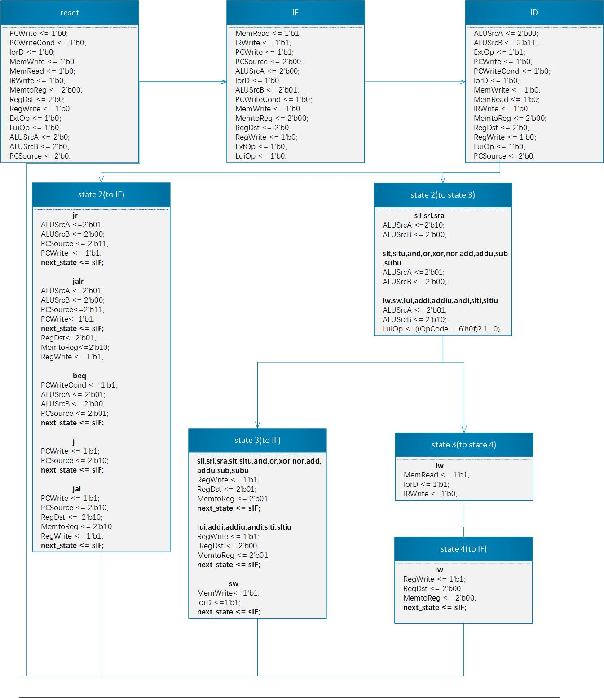

# 处理器第二次大作业实验报告

## 实验目的

1. 掌握 MIPS 单周期处理器的控制通路和数据通路的设计原理和 RTL 实现方法；
2. 掌握 MIPS 多周期处理器的控制通路和数据通路的设计原理和 RTL 实现方法；
3. 深入理解 MIPS 单周期和多周期处理器在资源和性能上的设计折衷。

## MIPS单周期CPU

### 控制器模块真值表

|       | PCSrc[1:0] | Branch | RegWrite | RegDst [1:0] | MemRead | MemWrite | MemtoReg I1:0 | ALUSrcl | ALUSrc2 | ExtOp | LuOp |
| ----- | ---------- | ------ | -------- | ------------ | ------- | -------- | ------------- | ------- | ------- | ----- | ---- |
| lw    | 0          | 0      | 1        | 0            | 1       | 0        | 0             | 0       | 1       | 1     | 0    |
| sw    | 0          | 0      | 0        | x            | 0       | 1        | 1             | 0       | 1       | 1     | 0    |
| lui   | 0          | 0      | 1        | 0            | 0       | 0        | 0             | 0       | 1       | x     | 1    |
| add   | 0          | 0      | 1        | 1            | 0       | 0        | 0             | 0       | 0       | x     | x    |
| addu  | 0          | 0      | 1        | 1            | 0       | 0        | 0             | 0       | 0       | x     | x    |
| sub   | 0          | 0      | 1        | 1            | 0       | 0        | 0             | 0       | 0       | x     | x    |
| subu  | 0          | 0      | 1        | 1            | 0       | 0        | 0             | 0       | 0       | x     | x    |
| addi  | 0          | 0      | 1        | 0            | 0       | 0        | 0             | 0       | 1       | 1     | 0    |
| addiu | 0          | 0      | 1        | 0            | 0       | 0        | 0             | 0       | 1       | 1     | 0    |
| and   | 0          | 0      | 1        | 1            | 0       | 0        | 0             | 0       | 0       | x     | x    |
| or    | 0          | 0      | 1        | 1            | 0       | 0        | 0             | 0       | 0       | x     | x    |
| xor   | 0          | 0      | 1        | 1            | 0       | 0        | 0             | 0       | 0       | x     | x    |
| nor   | 0          | 0      | 1        | 1            | 0       | 0        | 0             | 0       | 0       | x     | x    |
| andi  | 0          | 0      | 1        | 0            | 0       | 0        | 0             | 0       | 1       | 0     | 0    |
| sll   | 0          | 0      | 1        | 1            | 0       | 0        | 0             | 1       | 0       | x     | x    |
| srl   | 0          | 0      | 1        | 1            | 0       | 0        | 0             | 1       | 0       | x     | x    |
| sra   | 0          | 0      | 1        | 1            | 0       | 0        | 0             | 1       | 0       | x     | x    |
| slt   | 0          | 0      | 1        | 1            | 0       | 0        | 0             | 0       | 0       | x     | x    |
| sltu  | 0          | 0      | 1        | 1            | 0       | 0        | 0             | 0       | 0       | x     | x    |
| slti  | 0          | 0      | 1        | 0            | 0       | 0        | 0             | 0       | 1       | 1     | 0    |
| sltiu | 0          | 0      | 1        | 0            | 0       | 0        | 0             | 0       | 1       | 1     | 0    |
| beq   | 0          | 1      | 0        | x            | 0       | 0        | x             | 0       | 0       | 1     | 0    |
| j     | 1          | x      | 0        | x            | 0       | 0        | x             | x       | x       | x     | x    |
| jal   | 1          | x      | 1        | 2            | 0       | 0        | 2             | x       | x       | x     | x    |
| jr    | 2          | x      | 0        | x            | 0       | 0        | x             | x       | x       | x     | x    |
| jalr  | 2          | x      | 1        | 1            | 0       | 0        | 2             | x       | x       | x     | x    |

### 数据通路设计

#### 数据通路图

#### 多路选择器

总共包含五个多路选择器，分别对应的控制信号为：`MemtoReg, RegDst, ExtOp, ALUSrc1, ALUSrc2, PCSrc`。

`MemtoReg`用于选择是否从数据存储器取出信号。进入该多路选择器的信号有三个来源：

- 0：ALU的计算结果

- 1：sw指令中，从数据存储器取出的信号

- 2：jal或jalr指令中，需要保存到寄存器ra的值

- ~~~verilog
  assign WriteData = MemtoReg == 0 ? ALUresult : 
                         MemtoReg == 2 ? PC + 4 : ReadData;
  ~~~

`RegDst`用于筛选存回寄存器堆的寄存器，即选择该寄存器是rd还是rt。

- 若`RegDst==0`，则取rd，否则取rt

- ~~~verilog
  assign Rw = RegDst == 0 ? Instruction[20:16] : Instruction[15:11];
  ~~~

`ALUSrc1`用于筛选进入`ALU`的第1个信号，它有两个来源：

- 从寄存器堆中，读取rs寄存器的值

- R型指令中5bit的偏移量

- ~~~verilog
  assign ALUin1 = ALUSrc1 ? {27'h0000000, Instruction[10:6]} : data1;
  ~~~

`ALUSrc2`用于筛选进入`ALU`的第2个信号，它有两个来源：

- 立即数
- 从寄存器堆中，读取rt寄存器的值

其中，立即数需要做扩展，扩展方式由`ExtOp`决定

- ~~~verilog
  assign ALUin2 = ALUSrc2 ? (ExtOp ? {{16{Instruction[15]}}, Instruction[15:0]} : {16'h0000, Instruction[15:0]}) : data2;
  ~~~

`PCSrc`用于选择`PC`是否进行无条件跳转，其值的意义如下

- 0：不进行无条件跳转

- 1：j或jal指令，伪直接寻址

- 2：jr或jalr指令

- 若`Branch == 1 && Zero == 1`，为`beq`指令成立的状况，采用PC相对寻址跳转

- ~~~verilog
  always@(posedge clk or posedge reset) begin
          if(reset)
              PC <= 0;
          else if(PCSrc == 1)
              PC <= {PC[31:28], Instruction[25:0], 00};
          else if (PCSrc == 2)
              PC <= ALUresult;
          else if(Branch & Zero)
              PC <= PC + 4 + (Instruction[15:0] << 2);
          else 
              PC <= PC + 4;
  end
  ~~~

### 汇编程序分析

#### 计算过程

~~~python
a0 = 0 + 12123 = 12123
a1 = 0 - 12345 = -12345
a2 = a1 << 16 = -12345 * 2^16 = -809041920
a3 = a2 >>> 16 = a2 / 2^16 = -12345
a1 == a3 	# True, 跳转

L1:
t0 = a2 + a0 = -809029797
t1 = t0 >>> 8 = t0 / 2^8 = -3160273
t2 = 0 - 12123 = -12123
v0 = a0 < t2 = 0	# 有符号比较
v1 = a0 < t2 = 1	# 无符号比较
~~~

最后的结果为

~~~python
a0 = 12123
a1 = -12345
a2 = -809041920
a3 = -12345
t0 = -809029797
t1 = -3160273
t2 = -12123
v0 = 0
v1 = 1
~~~

#### 仿真分析

仿真波形图如下（2~10寄存器，依次对应v0~v1, a0~a3, t0~t3）

结果完全正确。

仿真结果的第一行显示的是PC的工作状态，其与仿真测试文件的代码预期完全符合。

综上说明单周期处理器设计正确。

## MIPS多周期CPU

### 状态转移图

多周期状态转移图如下

### 多周期CPU的ALU控制逻辑与功能实现

#### Controller.v

在Controller.v中，需要完成ALUOp的实现。ALUOp实际上是OpCode的简化，并且要综合考虑状态信息。

ALUOp共4 bit，其中后3 bit用于指示运算类型，第1个bit用于记录I型指令的Sign情况。

- 因为对于I型指令，有无符号是和OPCode的奇偶性有关的，所以可以令`ALUOp[3]=OpCode[0]`，从而记录I型指令的Sign情况。

- 后3bit指定运算类型。其中beq指令是需要特殊考虑的：

  - 在IF、ID阶段，beq指令对应的计算类型为ADD，用于提前计算跳转的地址；在后续阶段，beq指令的计算类型为SUB，用于计算两个操作数相减是否为0。

  - 我将所有操作类型用`paremeter`表示，分别为

    ~~~verilog
    parameter ALUOp_ADD = 3'b000;
    parameter ALUOp_NULL = 3'b001;
    parameter ALUOp_SLT = 3'b010;
    parameter ALUOp_SUB = 3'b011;
    parameter ALUOp_AND = 3'b100;
    ~~~

    其中，`ALUOp_NULL`代表暂时不知道该进行怎样的操作。

#### ALUControl.v

Sign可以通过输入的ALUOp进行判断

- 首先判断是否为R型指令，若为R型指令，由于R型指令有无符号计算，由Funct奇偶性决定，所以只需判断Funct[0]即可

- 若不为R型指令，则为I型指令，由输入的ALUOp的第0位决定（即OpCode的奇偶性）

- ~~~verilog
  assign Sign = (ALUOp[2:0] == ALUOp_NULL)? ~Funct[0]: ~ALUOp[3];  // R ? ~Funct0 : ~I0 
  ~~~

ALUCtrl可以经过计算得到

- 首先，若为操作立即数的I型指令，可以在Controller.v中就已经定义好，这里可以直接赋值

  - 包括ADD、SUB、SLT、AND四组I型指令，它们分别对应如下指令
    - ADD：addi、addiu、lui、IF与ID阶段的所有指令
    - SUB：beq（ID阶段后）
    - SLT：slti、sltiu
    - AND：andi

- 若为R型指令，则需要进行进一步的计算，得到相应的ALUCtrl，具体而言就是不同的Funct值对应不同的操作

- 具体代码逻辑如下：

- ~~~verilog
  module ALUControl (ALUOp, Funct, ALUCtrl, Sign);
  // parameter here
  // i.e: 
  // ADD = xxx, SUB=xxx
      
  assign Sign = (ALUOp[2:0] == ALUOp_NULL)? ~Funct[0]: ~ALUOp[3];  // R ? ~Funct0 : ~I0 
  
  reg [4:0] ALUConf;
  always @(*) begin
      case(ALUOp[2:0]) 
          // ALUCtrl <= xxx
          ALUOp_NULL: ALUCtrl <= ALUConf;
          // ...
      endcase
  end
      
  always @(*) begin
      case(Funct)
          // ALUConf <= xxx
      endcase
  end
  
  endmodule
  ~~~

#### ALU.v

ALU.v的代码可以用上次作业写好的代码。

### 数据通路设计

#### 寄存器

需要用到一个MDR寄存器（Memory Data Register），用于存储从memory中取出的信息。

~~~verilog
wire [31:0] MDRout;
RegTemp MDR(reset, clk, MemData, MDRout);
~~~

需要指令寄存器，存储指令译码结果。

~~~verilog
InstReg Decoder(reset, clk, IRWrite, Instruction, OpCode, rs, rt, rd, Shamt, Funct);
~~~

需要用到控制寄存器，储存各种控制信号

~~~verilog
Controller Ctrl1(reset, clk, OpCode, Funct, PCWrite, 
                        PCWriteCond, IorD, MemWrite, MemRead, IRWrite, 
                            MemtoReg, RegDst, RegWrite, ExtOp, LuiOp,
                                ALUSrcA, ALUSrcB, ALUOp, PCSource);
~~~

需要用到两个寄存器，用于储存从rs，rt中取出的值

~~~verilog
wire [31:0] dataA_out;
wire [31:0] dataB_out;
RegTemp dataAReg(reset, clk, dataA, dataA_out);
RegTemp dataBReg(reset, clk, dataB, dataB_out);
~~~

需要用到一个存储ALU输出的寄存器，便于beq指令判断成功后直接跳转。

~~~verilog
wire [31:0] ALUOutbeq;
RegTemp ALUOut1(reset, clk, ALUOutput, ALUOutbeq);
~~~

需要用到一个PC寄存器，存PC

~~~verilog
PC PCController(reset, clk, PCWrite_hat, PC_new, PC_now);
~~~

#### 多路选择器

Address信号需要多路选择器控制，控制信号为IorD，指示address是ALU计算结果还是当前PC。

~~~verilog
assign Address = IorD ? ALUOutput : PC_now;
~~~

指令信号Instruction需要由多路选择器控制，控制信号为IRWrite，用于选择是从memory中更新指令还是保持当前指令

~~~verilog
assign Instruction = IRWrite ? MemData : Instruction;
~~~

写入寄存器堆的寄存器编号需要由多路选择器控制，可选为rt，rd或ra寄存器，控制信号为RegDst

~~~verilog
wire [4:0] Rw;    // 0: rt; 1: rd; 2: ra
assign Rw = RegDst == 2'b00 ? rt : 
    			RegDst == 2'b01 ? rd : 31;
~~~

写回寄存器堆的数据可以选择是当前PC（PC+4，jal指令），MDR的值或是ALU计算结果，控制信号为MemtoReg

~~~verilog
assign Write_data = MemtoReg == 2'b10 ? PC_now:      // ra
                           MemtoReg == 2'b00 ? MDRout : ALUOutput;
~~~

ALU的两个输入也需要进行选择。A输入端可选为移位量，或当前PC，或从寄存器rs中取出的值；B输入端可选为扩展的立即数，移位的立即数，立即数4或从rt中取出的值

~~~verilog
assign ALUinA = ALUSrcA == 2'b10 ? {27'h0000000, Shamt} :
                        ALUSrcA == 2'b00 ? PC_now : dataA_out;
assign ALUinB = ALUSrcB == 2'b11 ? ImmExtShift :
                        ALUSrcB == 2'b10 ? ImmExtOut :
                            ALUSrcB == 2'b01 ? 32'd04 : dataB_out;
~~~

新PC的值也需要选择，从j指令跳转地址、beq跳转地址（ALU输出寄存器）、读取的rs寄存器的值和ALU输出中选择，控制信号为PCSource

~~~verilog
assign PC_new = PCSource == 2'b10 ? {PC_now[31:28], rs, rt, rd, Shamt, Funct, 2'b00} : 
                        PCSource == 2'b01 ? ALUOutbeq : 
                            PCSource == 2'b11 ? dataA_out : ALUOutput;
~~~

### 功能验证

仿真结果如下

结果与理论计算相符。

## 单周期、多周期对比

### 功能与程序注释

若将第0行的5替换为n，则该程序计算：`n + (n-1) + ... + 2 + 1 + 1 + 2 +...+ (n-1) + n`的值。

程序注释如下

~~~assembly
addi $a0, $zero, 5	# a0 = 5
xor $v0, $zero, $zero	# v0 = 0
jal sum				# 调用 sum 函数，跳转到sum
Loop: beq $zero, $zero, Loop	# 计算已结束，在这死循环
sum: addi $sp, $sp, -8 	# 分配 8 字节栈帧
sw $ra, 4($sp)	# 保存当前$ra到栈中，位置为sp + 4
sw $a0, 0($sp)	# 保存形参a0到栈中，位置为sp
slti $t0, $a0, 1	# t0 = a0 < 1 ? 1 : 0
beq $t0, $zero, L1	# 若t0 == 0，跳转到L1 
addi $sp, $sp, 8	# 恢复栈，上移 8 bytes
jr $ra			   # 返回
L1: add $v0, $a0, $v0	# v0 += a0
addi $a0, $a0, -1 	# a0--
jal sum			   # 跳转到sum
lw $a0, 0($sp)	    # 取出保存在栈中的a0
lw $ra, 4($sp)		# 取出保存在栈中的ra
addi $sp, $sp, 8	# 恢复栈，上移 8 bytes
add $v0, $a0, $v0	# v0 += a0
jr $ra			   # 返回
~~~

### 机器码翻译

机器码翻译的文件用“-2”标记，原本的指令文件用“-1”表示。

### 仿真结果

#### 单周期

运行足够长时间后，a0为5，v0为30，符合预期。

#### 多周期

运行足够长时间后，a0为5，v0为30，符合预期。

#### 

### 资源与性能对比

#### 资源对比

##### 单周期

单周期资源占用情况如下

单周期CPU，共占用3398个LUT，8389个寄存器，34个IO接口。

##### 多周期

多周期资源占用情况如下

多周期CPU，共占用4034个LUT，9434个寄存器，34个IO接口。

#### 时序性能对比

综合都使用周期为20ns的虚拟时钟。

##### 单周期

单周期CPU时序性能如下

总共检查16740个点，WNS为6.077ns，WHS为0.288ns。

考虑关键路径延时如下

单词计算所需的最低延时为13.413ns。

由于最高延时为13.772ns，从而可以计算所设计的单周期CPU，频率最高为
$$
f_{max} = \frac{1}{13.772ns} = 72.61MHz
$$

##### 多周期

多周期时序性能如下

总共检查18632个点，WNS是9.896ns，WHS为0.160ns。

考虑关键路径延时如下

单次计算所需要的最低延时为9.722ns。

因为最高延时为9.722ns，从而可以计算所设计的多周期CPU，频率最高为
$$
f_{max} = \frac{1}{9.722ns} = 102.86MHz
$$

#### 对比分析

单周期最高时钟频率为72.61MHz，频率较低，但耗费资源较少；多周期最高时钟频率102.86MHz，频率更高，但耗费资源更多，且由于各个操作需要多周期，因此可能总体性能不一定会更好。

## 材料说明

单周期代码文件放在`single_cycle`下，多周期代码文件放在`multi_cycle`下。

其中，原本的指令文件分别为`single_cycle/InstructionMemory-1.v`、`multi_cycle/InstAndDataMemory-1.v`

机器码翻译的指令文件分别为`single_cycle/InstructionMemory-2.v`、`multi_cycle/InstAndDataMemory-2.v`
